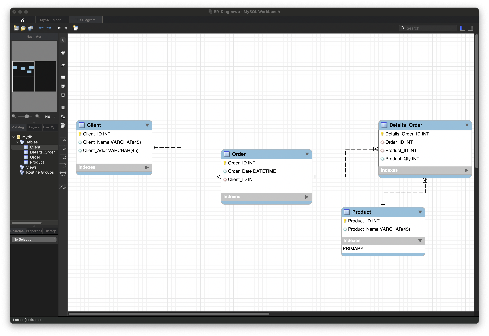
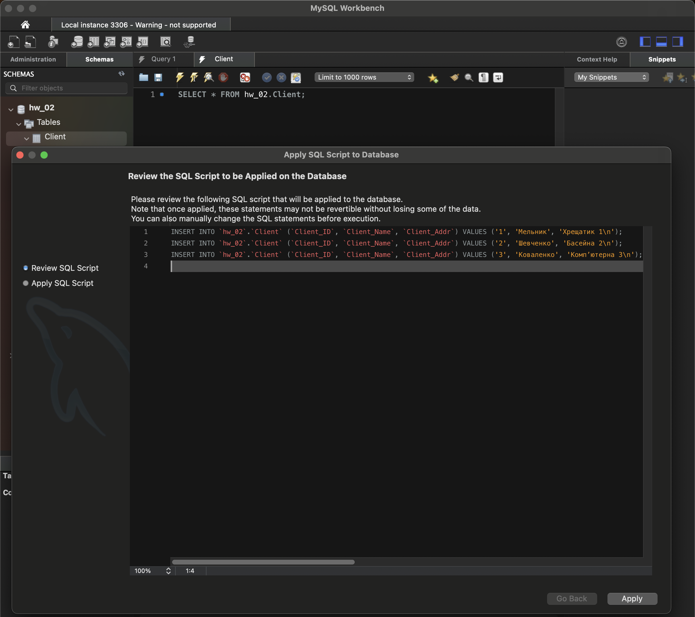
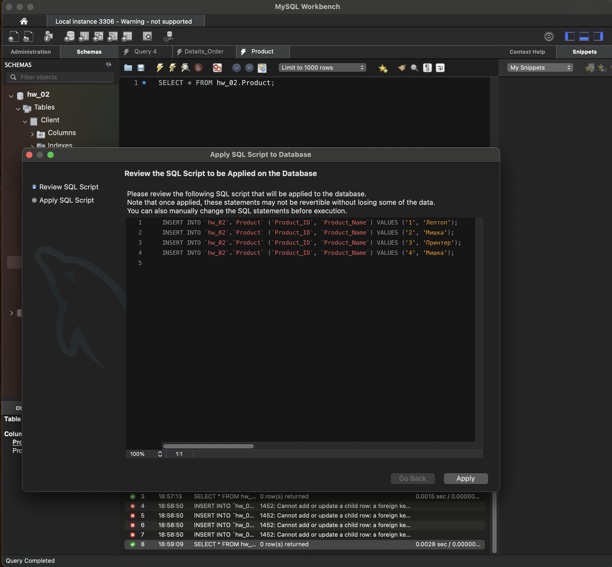
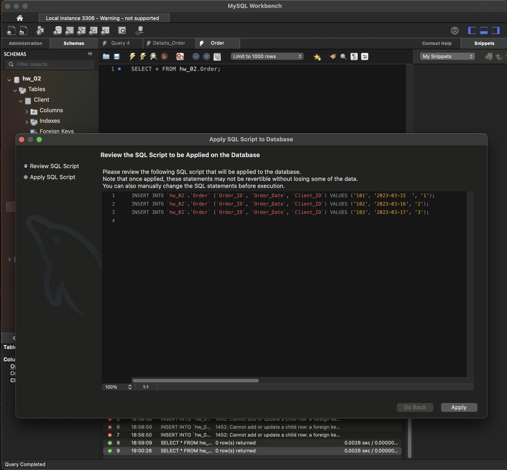
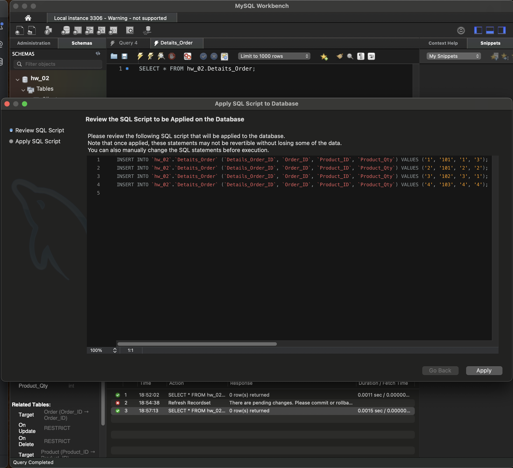
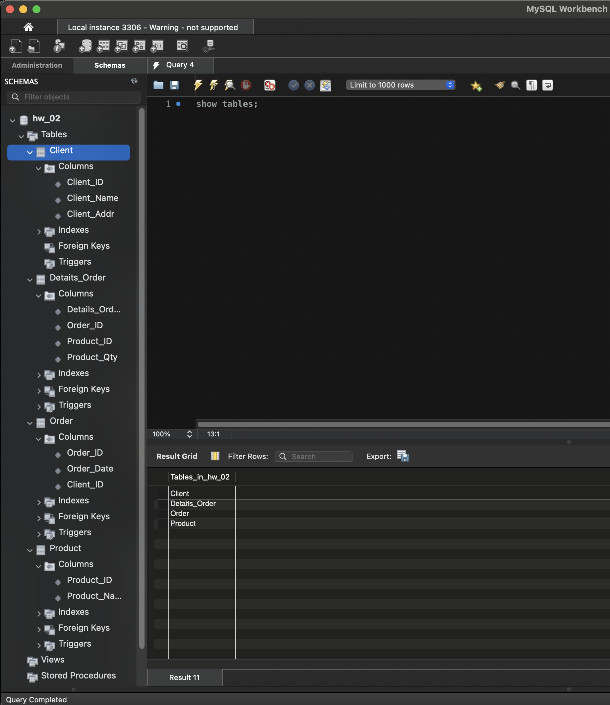

# Домашнє завдання до Теми 2. Проектування баз даних з використанням семантичних моделей
## 1. Переведіть початкову таблицю в першу нормальну форму.
Отже, початкова таблиця має наступний вигляд:

| Номер_замовлення | Назва_товару і кількість | Адреса_клієнта | Дата_замовлення | Клієнт    |
|------------------|--------------------------|----------------|-----------------|-----------|
| 101              | Лептоп: 3, Мишка: 2      | Хрещатик 1     | 2023-03-15      | Мельник   |
| 102              | Принтер: 1               | Басейна 2      | 2023-03-16      | Шевченко  |
| 103              | Мишка: 4                 | Компʼютерна 3  | 2023-03-17      | Коваленко |

Переведемо в першу нормальну форму:

| Номер_замовлення | Назва_товару | Кількість | Адреса_клієнта | Дата_замовлення | Клієнт    |
|------------------|--------------|-----------|----------------|-----------------|-----------|
| 101              | Лептоп       | 3         | Хрещатик 1     | 2023-03-15      | Мельник   |
| 101              | Мишка        | 2         | Хрещатик 1     | 2023-03-15      | Мельник   |
| 102              | Принтер      | 1         | Басейна 2      | 2023-03-16      | Шевченко  |
| 103              | Мишка        | 4         | Компʼютерна 3  | 2023-03-17      | Коваленко |

## 2. Переведіть нові таблиці в другу нормальну форму.
Оберемо комбінованим ключовим атрибутом `Номер замовлення` та `Назва товару`.

| 🔑Номер_замовлення | 🔑Назва_товару | Кількість | Адреса_клієнта | Дата_замовлення | Клієнт    |
|--------------------|----------------|-----------|----------------|-----------------|-----------|
| 101                | Лептоп         | 3         | Хрещатик 1     | 2023-03-15      | Мельник   |
| 101                | Мишка          | 2         | Хрещатик 1     | 2023-03-15      | Мельник   |
| 102                | Принтер        | 1         | Басейна 2      | 2023-03-16      | Шевченко  |
| 103                | Мишка          | 4         | Компʼютерна 3  | 2023-03-17      | Коваленко |

Та приведемо таблицю до другої нормальної форми

_Замовлення_

| 🔑Номер_замовлення | Адреса_клієнта | Дата_замовлення   | Клієнт    |
|--------------------|----------------|-------------------|-----------|
| 101                | Хрещатик 1     | 2023-03-15        | Мельник   |
| 102                | Басейна 2      | 2023-03-16        | Шевченко  |
| 103                | Компʼютерна 3  | 2023-03-17        | Коваленко |

_Деталі замовлення_

| 🔑Номер_замовлення | 🔑Назва_товару | Кількість |
|--------------------|----------------|-----------|
| 101                | Лептоп         | 3         | 
| 101                | Мишка          | 2         |
| 102                | Принтер        | 1         |
| 103                | Мишка          | 4         |

## 3. Переведіть нові таблиці в третю нормальну форму.
### Лекційна версія 3НФ
_Клієнти_

| 🔑Клієнт  | Адреса_клієнта |
|-----------|----------------|
| Мельник   | Хрещатик 1     |
| Шевченко  | Басейна 2      |
| Коваленко | Компʼютерна 3  |

_Замовлення_

| 🔑Номер_замовлення | Дата_замовлення   | Клієнт    |
|--------------------|-------------------|-----------|
| 101                | 2023-03-15        | Мельник   |
| 102                | 2023-03-16        | Шевченко  |
| 103                | 2023-03-17        | Коваленко |

_Деталі замовлень_

| 🔑Номер_замовлення | 🔑Назва_товару | Кількість |
|--------------------|----------------|-----------|
| 101                | Лептоп         | 3         | 
| 101                | Мишка          | 2         |
| 102                | Принтер        | 1         |
| 103                | Мишка          | 4         |

### "Практична" версія 3НФ

_Client_

| 🔑Client_ID | Client_Name | Client_Addr   |
|-------------|-------------|---------------|
| 1           | Мельник     | Хрещатик 1    |
| 2           | Шевченко    | Басейна 2     |
| 3           | Коваленко   | Компʼютерна 3 |

_Product_

| 🔑Product_ID | Product_Name |
|--------------|--------------|
| 1            | Лептоп       |
| 2            | Мишка        |
| 3            | Принтер      |
| 4            | Мишка        |

_Order_

| 🔑Order_ID | Order_Date | Client_ID |
|------------|------------|-----------|
| 101        | 2023-03-15 | 1         |
| 102        | 2023-03-16 | 2         |
| 103        | 2023-03-17 | 3         |

_Detaits_Order_

| 🔑Details_Order_ID | Order_ID | Product_ID | Product_Qty |
|--------------------|----------|------------|-------------|
| 1                  | 101      | 1          | 3           | 
| 2                  | 101      | 2          | 2           |
| 3                  | 102      | 3          | 1           |
| 4                  | 103      | 4          | 4           |

## 4. Розробіть ER-діаграму отриманих таблиць.
Розроблю ER-діаграму із "практичної" версії 3НФ

## 5. Використовуючи ER-діаграму, створіть таблиці в базі даних. Оформіть ці таблиці без конкретних значень, тільки з урахуванням колонок та їхніх зв'язків, вручну або автоматично.
Імпортував ER-діаграму в новостворену базу даних та наповнив таблиці даними.

І сама БД

